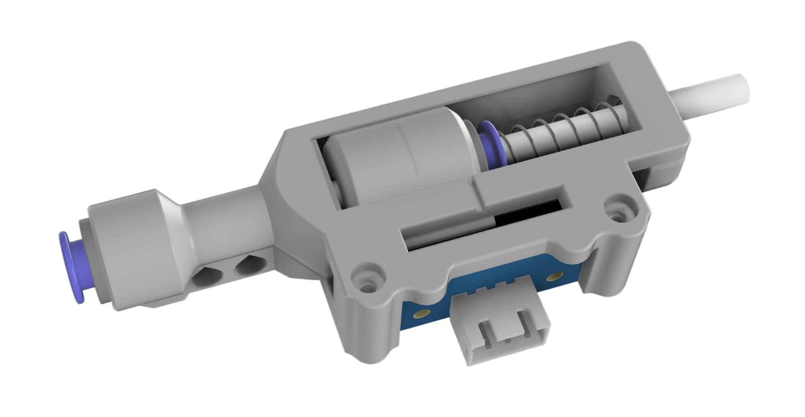
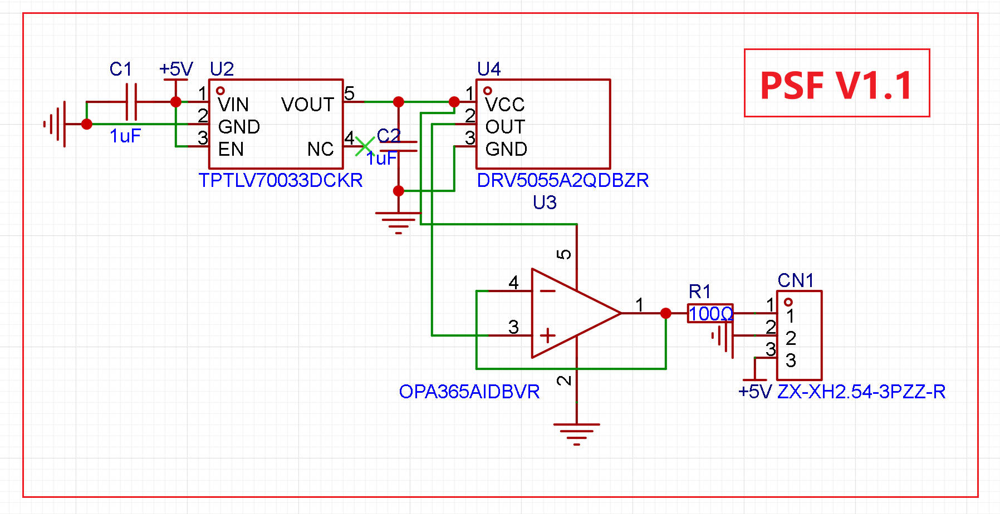
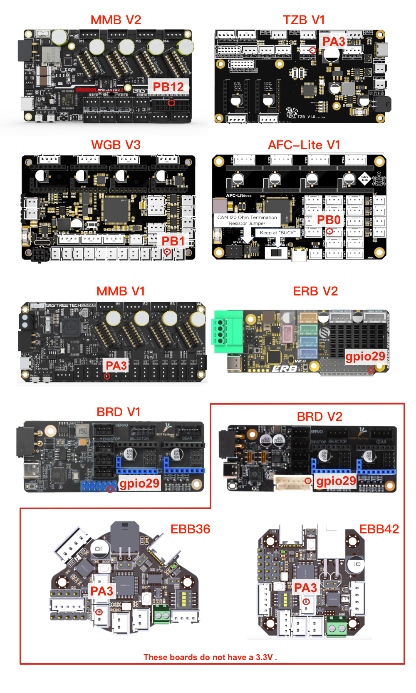
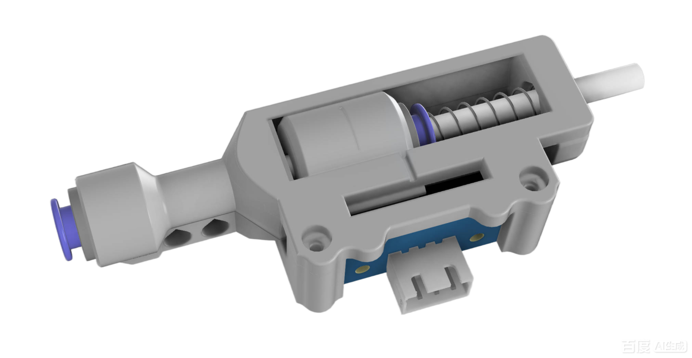

# PSF (Proportional Sync Feedback) Sensor for MMU

This is a Mini Proportional Sync Feedback Sensor solution designed for MMU systems.

After updating to V1.1, 
it should be possible to find a usable ADC interface and a suitable voltage interface on all MMU boards.


**Note:**

Currently shifted to the default single-spring version.
It provides constant compression, which reduces the apparent load on the extruder stepper and helps overcome Bowden friction.

The STLS folder still includes the dual-spring version.





## 🧩 What Is a Proportional Sync Feedback Sensor?

The Proportional Feedback Sensor is a more advanced feedback solution that uses analog signals.

Unlike other solutions that rely on D2F switches, it:

- **Outputs a signal ranging from 0 to 1**
- **0.5 represents the neutral position**

With this signal, the printer can determine the exact current position of the feedback slider and adjust it toward neutral at any moment.

Happy-Hare has developed many powerful additional features for this type of sensor. 

For details, please refer to the relevant Happy-Hare documentation.


## 🛠 Hardware Design

This design does not use a dedicated standalone mainboard.
Instead, it leverages the ADC input already available on existing MMU boards.

If you want to produce the boards yourself, the **PCB Gerber files** are provided and can be used under the GPLv3 license.
If you prefer not to make the boards yourself, you can get the kit mentioned below.


**✅ PSF Board Schematic and PCB**




**✅PCB Changelog**

V1.1
- Added wide input voltage support (3.3V–5V) compared to v1.0

V1.0
- Supports 3.3V input only
- Compatible with ADC interfaces with and without pull-up resistors


**✅Important Notice**


- You must connect the signal output to a pin that supports ADC input.

  > Recommended ADC Pins for common mainboards are shown in the diagram below.

- Version 1.1 supports a wide input voltage range of 3.3V–5V, while version 1.0 requires the power input to be 3.3V only.

  > ⚠️⚠️Do NOT use `5V` in Version 1.0 — this may damage your controller board.⚠️⚠️


**✅ADC Pull-up Considerations** 

Some boards—such as **MMB, EBB36, or EBB42**—have **built-in pull-up resistors** on all available ADC inputs.

To support both boards with and without pull-up resistors,  this sensor board uses a special design compatible with both cases.

Using an MMU board with ADC pull-ups will cause the sensor's ADC reading to shift upward (not constant; this has been minimized using the amplifier). 
You can adjust the neutral position value in the configuration to fix this issue.


## 📍 Recommended ADC GPIOs
You can refer to the chip datasheet to find all GPIOs that support ADC. Below, only one usable pin is marked.  

A list of recommended ADC-capable GPIOs for common MMU boards will be provided below:



## 📦 Bill of Materials (BOM)

| Item                            | Specification                                                | Quantity |
| ------------------------------- | ------------------------------------------------------------ | -------- |
| **PSF Board**                   | —                                                            | 1        |
| **Spring**                      | 0.4 mm × 6 mm × 25 mm, spring steel                          | 1        |
| **Magnet**                      | D4 mm × 15 mm N35                                            | 1        |
| **ECAS04 Bowden connector**     | —                                                            | 2        |
| **ECAS_Clip**                   | Please use the STL file for printing to ensure consistent thickness | 2        |
| **M2×6 mm SHCS screw**          |                                                              | 4        |
| **5V-to-3.3V Step-Down Module** | Optional: Only required for V1.0 PCB if your board doesn’t provide a 3.3V. | 1        |


**A kit is available on AliExpress:**  

[Aliexpress](https://www.aliexpress.com/item/1005010470743517.html)


## 🔧 Configuration & Calibration

At the moment, `Happy-Hare` has **integrated** support for Proportional Feedback Sensors, and the relevant Wiki documentation has already been published. 

👉➡️:  https://github.com/moggieuk/Happy-Hare/wiki/Synchronized-Gear-Extruder2 

For more detailed configuration, please refer to the HappyHare Wiki.


For PSF Sensor one-Spring:  

```  
sync_feedback_buffer_range: 14.5		# Travel in "buffer" between compression/tension or one sensor and end (see above)
sync_feedback_buffer_maxrange: 14.5	    # Absolute maximum end-to-end travel (mm) provided by buffer (see above)  
```




```
$ MMU_CALIBRATE_PSENSOR
...
// Calibration Results:
// As wired the recommended setting (in mmu_hardware.cfg) is:
// [mmu_sensors]
// sync_feedback_analog_max_compression: 0.0023
// sync_feedback_analog_max_tension:     0.9979
// sync_feedback_analog_neutral_point:   0.5001
// After updating, restart klipper
...
```


## 🙏 References & Acknowledgements

- The CAD design is based on modifications of [Tshine's Filament Sync Sensor](https://makerworld.com/en/models/507573).  
- The Proportional Sync Feedback concept is inspired by [OpenAMS FPS](https://github.com/OpenAMSOrg/filament-buffer).  
- Thanks to moggieuk, igiannakas, ningpj and KnightRadiant for their excellent code contributions related to Proportional Sync Feedback.
