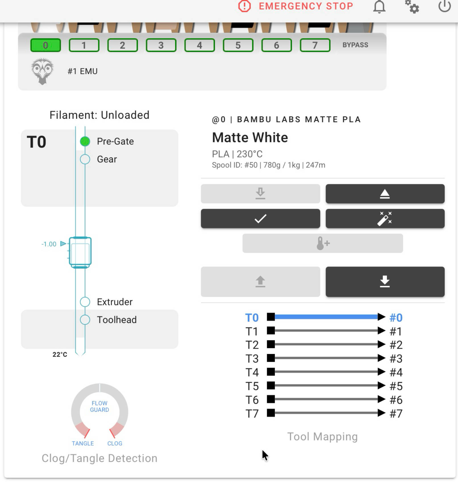
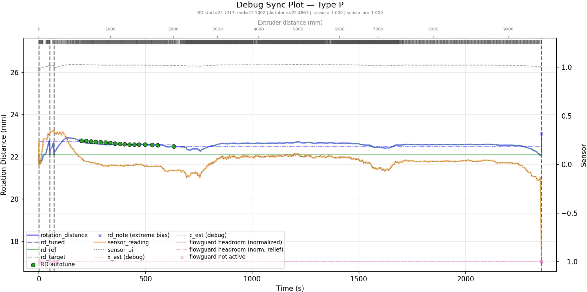

# PSF (Proportional Sync Feedback) Sensor for MMU

This is a Mini Proportional Sync Feedback Sensor solution designed for MMU systems.


**Note:**

Currently shifted to the default single-spring version.
It provides constant compression, which reduces the apparent load on the extruder stepper and helps overcome Bowden friction.

The STLS folder still includes the dual-spring version.


## 🧩 What Is a Proportional Sync Feedback Sensor?

The Proportional Feedback Sensor is a more advanced feedback solution that uses analog signals.

Unlike other solutions that rely on D2F switches, it:

- **Outputs a signal ranging from 0 to 1**
- **0.5 represents the neutral position**

With this signal, the printer can determine the exact current position of the feedback slider and adjust it toward neutral at any moment.

Happy-Hare has developed many powerful additional features for this type of sensor. 

For details, please refer to the relevant Happy-Hare documentation.


## 🛠 Hardware Design

This design does not use a dedicated standalone mainboard.
Instead, it leverages the ADC input already available on existing MMU boards.

After updating to V1.1, it should be possible to find a usable ADC interface and a suitable voltage interface on all MMU boards.

If you want to produce the boards yourself, the **PCB Gerber files** are provided and can be used under the GPLv3 license.
If you prefer not to make the boards yourself, you can get the kit mentioned below.


**✅ PSF Board Schematic and PCB**


**✅PCB Changelog**

V1.1
- Added wide input voltage support (3.3V–5V) compared to v1.0

V1.0
- Supports 3.3V input only
- Compatible with ADC interfaces with and without pull-up resistors


**✅Important Notice**


- You must connect the signal output to a pin that supports ADC input.

  > Recommended ADC Pins for common mainboards are shown in the diagram below.

- Version 1.1 supports a wide input voltage range of 3.3V–5V, while version 1.0 requires the power input to be 3.3V only.

  > ⚠️⚠️Do NOT use `5V` in Version 1.0 — this may damage your controller board.⚠️⚠️


**✅ADC Pull-up Considerations** 

Some boards—such as **MMB, EBB36, or EBB42**—have **built-in pull-up resistors** on all available ADC inputs.

To support both boards with and without pull-up resistors,  this sensor board uses a special design compatible with both cases.

Using an MMU board with ADC pull-ups will cause the sensor's ADC reading to shift upward by approximately +0.1V (not constant; this has been minimized using the amplifier). 
You can adjust the neutral position value in the configuration to fix this issue.


## 📍 Recommended ADC Pins
A list of recommended ADC-capable pins for common MMU boards will be provided below:


## 📦 Bill of Materials (BOM)

| Item                            | Specification                                                | Quantity |
| ------------------------------- | ------------------------------------------------------------ | -------- |
| **PSF Board**                   | —                                                            | 1        |
| **Spring**                      | 0.4 mm × 6 mm × 25 mm, spring steel                          | 1        |
| **Magnet**                      | D4 mm × 15 mm N35                                            | 1        |
| **ECAS04 Bowden connector**     | —                                                            | 2        |
| **ECAS_Clip**                   | Please use the STL file for printing to ensure consistent thickness | 2        |
| **M2×6 mm SHCS screw**          |                                                              | 4        |
| **5V-to-3.3V Step-Down Module** | Optional: Only required for V1.0 PCB if your board doesn’t provide a 3.3V. | 1        |


**A kit is available on AliExpress:**  

[Aliexpress](https://www.aliexpress.com/item/1005010470743517.html)


## 🔧 Configuration

At the moment, `Happy-Hare` has **integrated** support for Proportional Feedback Sensors, and the relevant Wiki documentation has already been published. 

👉➡️:  https://github.com/moggieuk/Happy-Hare/wiki/Synchronized-Gear-Extruder2 

For more detailed configuration, please refer to the HappyHare Wiki.

〰️〰️〰️〰️〰️〰️〰️〰️〰️〰️〰️〰️〰️〰️〰️〰️〰️〰️〰️〰️〰️〰️〰️〰️〰️〰️〰️〰️〰️〰️〰️〰️〰️
〰️〰️〰️〰️〰️〰️〰️〰️〰️〰️〰️〰️〰️〰️〰️〰️〰️〰️〰️〰️〰️〰️〰️〰️〰️〰️〰️〰️〰️〰️〰️〰️〰️


It is currently in open testing and requires switching to the following branch:

https://github.com/moggieuk/Happy-Hare/tree/flowguard

Before the official Wiki is updated, you can refer to the following instructions for configuration.


switching to the flowguard branch:

```bash
cd ~/Happy-Hare
./install.sh -b flowguard

(just remember to switch back to main when it is formerly released)
```


Afterwards, you need to modify the following settings:

**mmu_hardware.cfg**

```
[mmu_sensors]
...
sync_feedback_tension_pin: {sync_feedback_tension_pin}
sync_feedback_compression_pin: {sync_feedback_compression_pin}

# Proportional sync feedback sensor configuration. Leave empty if not fitted.
# (if you have a proportional sensor the sync_feedback_tension_pin and sync_feedback_compression_pin would likely be empty)
#
sync_feedback_analog_pin: 			# The ADC pin where the proportional filament pressure sensor is installed
sync_feedback_analog_max_compression: 1		# Raw sensor reading at max filament compression (buffer squeezed)
sync_feedback_analog_max_tension: 0		# Raw sensor reading at max filament tension (buffer expanded)
sync_feedback_analog_neutral_point: 0.50	# Biasing of neutral point (sensor value 0). Normally close to 0.5
...
```


**mmu_parameters.cfg**

```
# Synchronized gear/extruder movement ----------------------------------------------------------------------------------
...
sync_feedback_enabled: 1		        # Turn off even if sensor is installed and active
sync_feedback_buffer_range: 14.5		# Travel in "buffer" between compression/tension or one sensor and end (see above)
sync_feedback_buffer_maxrange: 14.5	    # Absolute maximum end-to-end travel (mm) provided by buffer (see above)
sync_feedback_speed_multiplier: 5	    # % "twolevel" gear speed delta to keep filament neutral in buffer (recommend 5%)
sync_feedback_boost_multiplier: 3	    # % "twolevel" extra gear speed boost for finding initial neutral position (recommend 3%)
sync_feedback_extrude_threshold: 5	    # Extruder movement (mm) for updates (keep small but set > retract distance)

# If defined this forces debugging to a telemetry log file "sync_<gate>.jsonl". This is great if trying to tune clog/tangle
# detection or for getting help on the Happy Hare forum. To plot graph of sync-feedback operation, run:
#  ~/Happy-Hare/utils/plot_sync_feedback.sh
#
sync_feedback_debug_log: 0		# 0 = disable (normal operation), 1 = enable telemetry log (for debugging)
...


...
# FLowguard Clog and Tangle Detection --------------------------------------------------------------------------------
# ███████╗██╗      ██████╗ ██╗    ██╗ ██████╗ ██╗   ██╗ █████╗ ██████╗ ██████╗
# ██╔════╝██║     ██╔═══██╗██║    ██║██╔════╝ ██║   ██║██╔══██╗██╔══██╗██╔══██╗
# █████╗  ██║     ██║   ██║██║ █╗ ██║██║  ███╗██║   ██║███████║██████╔╝██║  ██║
# ██╔══╝  ██║     ██║   ██║██║███╗██║██║   ██║██║   ██║██╔══██║██╔══██╗██║  ██║
# ██║     ███████╗╚██████╔╝╚███╔███╔╝╚██████╔╝╚██████╔╝██║  ██║██║  ██║██████╔╝
# ╚═╝     ╚══════╝ ╚═════╝  ╚══╝╚══╝  ╚═════╝  ╚═════╝ ╚═╝  ╚═╝╚═╝  ╚═╝╚═════╝
#
# Options are available to automatically detects extruder clogs and MMU tangles. Each option works independently and
# can be combined. Flowguard can even discern the difference between an extruder clog and a spool tangle!
#
# Flowguard:  This intelligently measures filament tension (only available if sync-feedback buffer is fitted)
#
# Encoder detection: This monitors encoder movement and compares to extruder (only available if encoder is fitted)
#
flowguard_enabled: 1			# 0 = Flowguard protection disabled, 1 = Enabled

# The flowguard_max_relief is the amount of relief movement (mm) that Happy Hare will wait until triggering a clog or runout.
# A smaller value is more sensitive to triggering. Since the relief depends on 'sync_feedback_speed_multiplier' and
# 'sync_feedback_buffer_range'. It is generally a good starting point if using 5% sync_feedback_speed_multiplier to use
# about the same distance as sync_feedback_buffer_range. Note that one sided switches (Compression-only and Tension-only)
# can generally be lower.
flowguard_max_relief: 8

# The max_motion is the absolute max permitted extruder movement while the sensor is in an extreme state. Consider this
# added protection on top of the primary max_relief amount. Again a smaller value is more sensitive to triggering.
# Note that this will have to increase if 'sync_feedback_speed_multiplier' is decreased because of slower recovery.
flowguard_max_motion: 120

# Encoder runout/clog/tangle detection watches for movement over either a static or automatically adjusted distance - if
# no encoder movement is seen when the extruder moves this distance runout/ clog/tangle event will be generated. Allowing
# the distance to be adjusted automatically (mode=2) will generally allow for a quicker trigger but use a static length
# (mode=1, set max_motion) if you get false triggers (see flowguard guide on wiki for more details)
# Note that this feature cannot disinguish between clog or tangle.
flowguard_encoder_mode: 2		# 0 = Disable, 1 = Static length clog detection, 2 = Automatic length clog detection

# The encoder_max_motion is the absolute max permitted extruder movement without the encoder seeing movement when using
# status mode (mode=1). Smaller values are more sensitive but beware of going too small - slack and friction in the
# bowden may cause gaps in encoder movement.
# Note that this value is overriden by any calibrated value stored in 'mmu_vars.cfg' if in automatic mode (mode=2).
flowguard_encoder_max_motion: 20
...
```


##  ⚙️ Calibration

#### Manual Calibration

Happy-Hare provides a command, `MMU_QUERY_PSENSOR`, to obtain the current raw ADC value. 

```
$ MMU_QUERY_PSENSOR
echo: PSENSOR Enabled: True  Value: -1.0  Raw Value: 0.997
```

You can remove the PSF PCB and place it in a magnetic-field-free environment, use this command to get the value of `sync_feedback_analog_neutral_point`. 

Then, move the slider to the Tension and Compression positions respectively to obtain the values of `sync_feedback_analog_max_tension` and `sync_feedback_analog_max_compression`.


#### Automatic Calibration

Happy-Hare provides a calibration command, `MMU_CALIBRATE_PSENSOR`, to automatically calibrate the values of the three ADCs. 

Before running this command, you need to load the filament into the toolhead.

```
$ MMU_CALIBRATE_PSENSOR
...
// Calibration Results:
// As wired the recommended setting (in mmu_hardware.cfg) is:
// [mmu_sensors]
// sync_feedback_analog_max_compression: 0.9865
// sync_feedback_analog_max_tension: 0.0016
// sync_feedback_analog_neutral_point: 0.4941
// After updating, restart klipper
...
```


## Others

#### Quickly return to the neutral position

In Happy-Hare, the command `MMU_SYNC_FEEDBACK ADJUST_TENSION=1` can be used to quickly move the slider to the neutral position. This command has already been incorporated into the Blobifier macros.


#### Mainsail Fluidd Integration

The relevant branches in moggieuk's repository have already added feature enhancements for this type of sensor.

```
https://github.com/moggieuk/fluidd-happy-hare-edition/tree/flowguard

https://github.com/moggieuk/mainsail-happy-hare-edition/tree/develop
```




#### Clog/Tangle Detection

In Happy-Hare, the Proportional Sensor can provide stable Clog/Tangle Detection and can be used as a replacement for an encoder in this function.

If the value remains above 0.8 or below -0.8 for a certain period of time, it can be considered a Clog/Tangle.


#### Generate Debug Sync Plot

First, set `mmu_parameters.cfg > sync_feedback_debug_log` to 1.

Then,

```
$ cd ~/Happy-Hare/utils/
$ ./plot_sync_feedback.sh ~/printer_data/logs/sync_<gate>.jsonl
Saved plot to sim_plot.png
```




## 🙏 References & Acknowledgements

- The CAD design is based on modifications of [Tshine's Filament Sync Sensor](https://makerworld.com/en/models/507573).  
- The Proportional Sync Feedback concept is inspired by [OpenAMS FPS](https://github.com/OpenAMSOrg/filament-buffer).  
- Thanks to moggieuk, igiannakas, ningpj and KnightRadiant for their excellent code contributions related to Proportional Sync Feedback.
